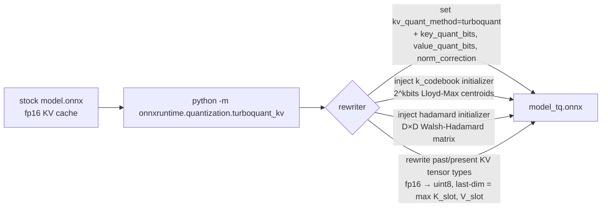
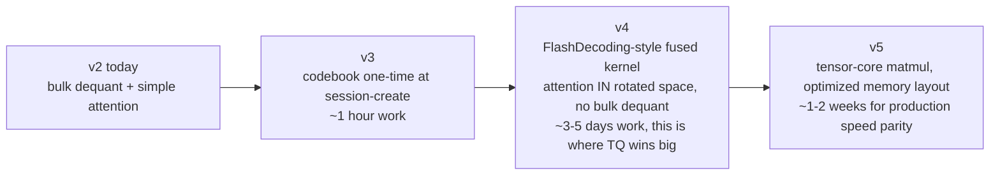

# TurboQuant in ONNX Runtime — flow

## one-time calibration (per model)



## per-decode-step inference (CUDA kernel)

```mermaid
flowchart TD
  Q["Q [B, S_q, hidden]<br/>K,V [B, kv_heads, S_q, head_dim]"]
  PK["past_key, past_value<br/>[B, kv_heads, max_seq, slot_bytes]<br/>uint8 packed"]
  CB["k_codebook<br/>[2^kbits] fp16"]
  H["hadamard<br/>[D, D] fp16"]

  Q --> ENC[TQEncodeKernel<br/>FWHT rotate K → Lloyd-Max codebook lookup<br/>uniform-asymmetric V → pack]
  CB --> ENC
  H -.algorithmic.-> ENC
  ENC --> CACHE["present cache<br/>uint8 packed bytes<br/>3.56× smaller than fp16"]

  CACHE --> DEC[TQDecodeKernel<br/>unpack indices → centroid lookup<br/>norm-correct, scale by ||k||<br/>FWHT inverse rotate]
  CB --> DEC
  DEC --> KFP["K_full, V_full fp16<br/>scratch buffer<br/>freed after call"]

  Q --> ATTN
  KFP --> ATTN[3 custom CUDA kernels<br/>TQScoresKernel: Q · K^T scaled, causal-masked<br/>TQSoftmaxRowKernel: per-row softmax with shared-mem reduction<br/>TQOutputKernel: scores · V → BSNH output]
  ATTN --> OUT["output [B, S_q, hidden]<br/>fp16, indistinguishable from fp16 baseline<br/>cos sim 0.99526, argmax match"]

  PK -.-> CACHE
  CACHE -.next step.-> PK
```

## what's still TODO (v3 / v4)


